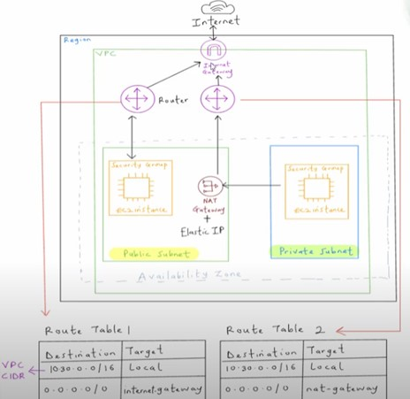

## 📖 Project Overview

This project demonstrates the **architecture and hands-on implementation of AWS networking fundamentals** using best practices.  

The setup includes:  
- A **custom VPC** with public and private subnets  
- An **Internet Gateway** for public resources  
- A **NAT Gateway** for secure outbound access from private resources  
- **Route Tables** configured for proper traffic routing  
- **EC2 instances** deployed in both subnets to test connectivity and isolation  

The public EC2 (bastion host) acts as a secure entry point, while the private EC2 is isolated from the internet and only reachable internally. ICMP (ping) and SSH were used to validate connectivity.  

 

## 🛠️ Technologies Used

> 📦 **Infrastructure Components**
> - Amazon VPC (CIDR: 10.0.0.0/16)  
> - Public Subnet (10.0.1.0/24)  
> - Private Subnet (10.0.2.0/24)  
> - Internet Gateway (IGW)  
> - NAT Gateway with Elastic IP  
>
> 💻 **Compute**
> - EC2 Instance (Public) → Bastion Host with Public IP  
> - EC2 Instance (Private) → Backend/Database server (no Public IP)  
>
> 🔒 **Security**
> - Security Groups (SSH, ICMP for testing)  
> - Route Tables (Public → IGW, Private → NAT)  
>
> ⚙️ **Tools**
> - AWS CLI (via Git Bash / VS Code terminal)  
> - Key Pairs (.pem) for SSH Access  

# 
<b>Architecture</b>

 

 
 

# 
<b>Simulation</b>

 

